## Some Weird Weapons Mod ~ GZDoom Edition
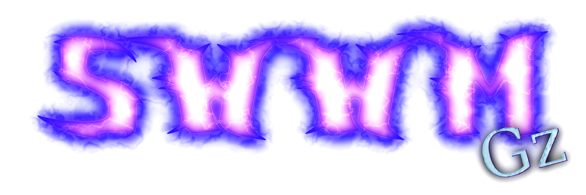

**SWWM GZ** brings to **GZDoom** a "best of" collection of custom weapons I've made for **Unreal Tournament**, plus many new things that didn't make the cut there.

It contains weapons and items remastered and revived from old projects such as the previous **SWWM** entries, along with the **Zanaveth Ultra Suite** side project, and also notably, the main **UnSX** series that never truly saw the light of day, as all work done on it so far has been lost forever. There may also be some original things here and there just to spice things up.

It also features ***A LOT*** of lore from the **UnSX multiverse**. I pretty much went wild here with all the stuff you can read, and I hope you enjoy immersing yourself into this vast world full of its many characters and their tales.

This is the first fully original mod I'm making since my work on **Doom Tournament** and **Doomreal**, and it is effectively built on the skills I've gained working on them, and some of their code also serves as a sort of foundation for it.

Hope you have fun exploding demon knees.

 — *Marisa*

## Disclaimers

This mod features loud sounds and flashing lights, which may be harmful to certain people. There are options to dampen some of these effects, but it may still be unsafe nonetheless.

The UI design and color schemes of the mod may be problematic to people with color blindness. Certain elements such as healthbars and various numbers could potentially become hard to see under some conditions. GZDoom has sliders for controlling not just brightness, contrast and gamma, but also color saturation, which may be of some help.

The characters and stories featured in this mod are part of my own personal lore. Any similarities to real world individuals or events are entirely coincidental or, in some cases, loosely referential.

The mod's overarching story and themes often tackle topics of world politics, economy, human rights and others. No work of fiction is free of politics, especially those that reflect the author's own beliefs. If you feel discomfort from political views opposite to your own, this may not be for you (especially if you're right-leaning/conservative).

The mod contains certain sexual undertones (or overtones in the story itself). Some parts could be considered explicit in nature, so please take this with a grain of salt. You've been warned: The mod *IS* horny (and so am I, as its author).

This mod is not compatible with **Brutal Doom** for obvious reasons. If you want to combine both, use the "Monsters Only" version of it, but do note that some glitches may still happen.

This mod is, funny enough, readily compatible with **H-Doom**. You will not be able to engage in erotic acts with the demon girls, however, but they will be very vulnerable to kisses and headpats.

## The Player
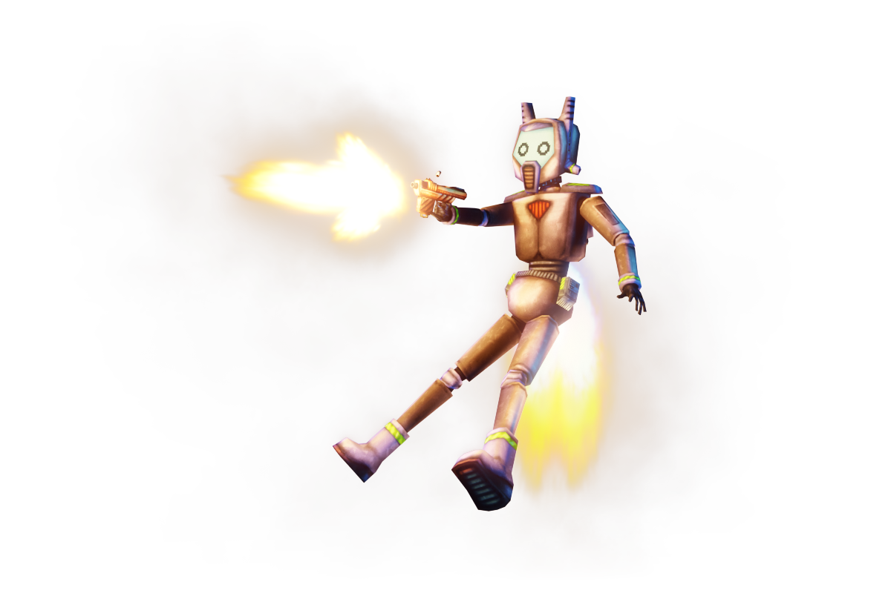

You are an **Akari Labs Demolitionist Bot**, one of the very first units, fresh off the factory. You are the company's greatest achievement in AI-controlled combat units, trained to efficiently use all sorts of weaponry, built with premium quality armor plating and robust but flexible joints. In order to show off your capabilities, your creator has decided to send you out to fight the demonic invasion brought upon by *"those big stinkin' idiots at the **UAC**"*. Your time has come to kick ass and blow 'em up.

Additional features:

 - **Glowing color tags:** Located around various parts of your body, allows quick and easy differentiation between multiple units (color not directly configurable due to *engine limitations™*).
 - **Lucky Collar:** A little something that your creator gives to all of her creations. Reduces incoming damage by 75% when you're below 25% health. Plus an additional 50% reduction to any damage from your own weapons.
 - **High-Resonant Almasteel Plating:** Your chassis is built from one of the hardest alloys known across the universe. Thus, your body is practically indestructible, but not impervious to damage. All direct damage is reduced by 50%, and all explosive damage is reduced by 80%.
 - **User Menu:** With the press of a button, open a dedicated menu to see all your stats in detail, info on carried items and weapons, check out a grand library of information on things you come across, and access the store for buying extra items with your score points.
 - **Magnetic Utility Belt:** Holds important equipment tightly, and is also the secret to how you can reload some weapons so damn fast.
 - **Keychain:** A lil' something to bring some extra good luck charms with you.
 - **Pocket Hammerspace™ containers:** These will store and deploy items on demand, along with keeping hold of any keys you find. The capacity for ammo storage can be increased by finding **Hammerspace™ Embiggener** modules.
 - **Forx JetBurst™ Impulsors:** Can be used for quick dashes in any direction, or even for short bursts of flight.
 - **Targetting Array:** Tracks nearby foes and provides basic information on their health. Compatible with **Omnisight™** mapping modules for tracking key items and nearby exits. Can also highlight nearby pickups by holding a dedicated button.
 - **Akari Labs CuteEmotion™ Display:** Equipped onto your visor to show a wide range of predefined facial expressions in order to convey simple emotions to others.
 - **Akari Labs LoudBoi™ Voicebox:** Allows you to 🇪 🇲 🇮 🇹. Easily moddable to allow alternate voicepack add-ons. Note that the default voice is in Japanese, but subtitles will be provided when needed.
 - **On-demand Item Obtainers:** AKA "hands". You can pick up the mod's items from a distance by pressing Use (this is mainly a workaround for any quirks that might come from them having modified collision).

**Note:** Since you're a robutt you pretty much can swim indefinitely and are also immune to poison.

## The Weapons
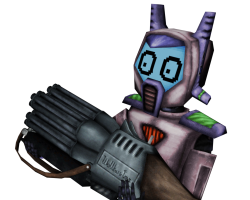

The arsenal this mod brings to the table is composed mainly of stupidly overpowered weapons, which has been my specialty for years.

Some weapons may have extra functions attached to the **Reload** or **Zoom** buttons, so don't forget to bind those too.

All weapons also have a quick melee attack using the **Weapon State 1** button, this is optional but may help to have it bound too.

If a weapon has no actions on either the reload or zoom buttons, it may be replaced with some special idle action, such as spinning or fiddling around with it.

For now, the following are all weapons planned for the first release. More will be added afterwards (until then I'll tease you with some empty ZScript files :P).

### Deep Impact (slot 1) ~ Replaces Fist, Staff, Hexen starting weapons
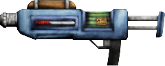

The signature **SWWM** melee weapon, an **Impact Hammer** on steroids.

**Primary fire:** Your usual compressed air push, you can use it to deflect projectiles or push away enemies that block your path.

**Secondary fire:** Charged shot that requires full air. Releases a potent *"air bullet"* that will tear through everything on its way.

**Reload:** Pump up more air.

Equipped by default on spawned players.

### Pusher (slot 1) ~ Replaces Chainsaw, Gauntlets, Timon's Axe

What was going to be the new melee weapon in **Ultra Suite 2**, but it never happened. A pimped up jackhammer.

**Primary fire:** Drill at whatever you're facing.

**Secondary fire:** Pull the drill bit back all the way in, then on button release push it back out with immense force. This will pretty much pierce a hole through anything, but if you miss there's a chance you'll lose grip on the weapon and it'll go flying until it hits something.

### Explodium Gun (slot 2) ~ Replaces Pistol, Elven Wand, Hexen starting weapons
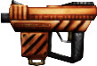

Primary firearm, another staple of the series, but more volatile than ever. A pocket rocket, a trusty ol' gun that uses **Explodium**-filled bullets to wreak some havoc.

**Primary fire:** The usual good ol' explosive shot. Has considerable knockback, but not really lethal damage.

**Secondary fire:** An *"explosive reload"*. Rather than just discarding the mag as usual, pulling the pin at the bottom arms it as a grenade that you can fling at enemies for increased damage. The yield will be proportional to the ammo left in it.

**Reload:** Just a plain ol' reload, nothing else, no explosions or anything.

Equipped by default on spawned players. Has infinite ammo.

If you manage to get a second one, you can dual wield them, in which case secondary fire instead shoots your off-hand gun.

### Spreadgun (slot 3) ~ Replaces Shotgun, Ethereal Crossbow, Serpent Staff
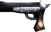

Coming from the **Doom** modding side of things, this gun really packs a punch, but is kind of unwieldy to use.

**Primary fire:** Fires, duh. Depending on the loaded ammo the effects may vary.

**Secondary fire:** Switches ammo type for the next shot to be loaded.

**Reload:** Unload the current shell and load a new one. Unspent shells are re-added to their respective ammo type pool (or dropped if you can't hold more).

The **Spreadgun** uses 10 gauge ammunition, apparently just for the sake of making it feel more powerful due to the increased recoil.

### 10Ga shells ~ Replaces Clip / Shells, Wand Crystal / Ethereal Arrows
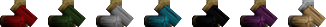

Available in the following types, with varying chances of appearing depending
on replaced item, may also come in bundles:

 - **Standard buckshot (red):** Lots of tiny pellets ready to tear enemies to shreds. Most common.
 - **Slug (green):** Concentrated damage in a single, large projectile. Common.
 - **Dragon's breath (white):** Fiery pain in one shot for everything in front of you. Not very effective underwater, but still deals some small heat damage. Somewhat rare.
 - **Kinylum saltshot (blue):** Highly volatile shards of **Kinylum** that leave behind a trail of burning plasma. Rare.
 - **Telebrium flechette (black):** A discharge of puncturing darts tipped with pure Telebrium, highly corrosive, effects may spread through emitted fumes. Very rare.
 - ***"The ball"* (purple):** A big lead ball, 'nuff said. Somewhat rare.
 - **Golden shell (self-explanatory color):** An extremely rare, but very valuable type. Fires a sabot packed with a very dense, high-grade **Explodium** charge, the shell also contains some gold glitter, but it's just for show. Clearly designed by someone completely insane, and definitely guaranteed to not fail catastrophically and blow up your gun, your hands, your arms, and the rest of your upper body. Unlike the others, this one is only available as a rare drop from powerful monsters (over 1000HP) and bosses. They may also appear in **Chanceboxes**.

### Wallbuster (slot 4) ~ Replaces SSG, Ethereal Crossbow, Frost Shards
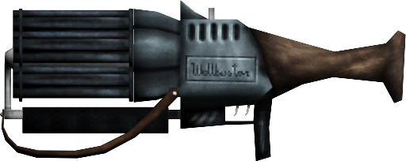

A ludicrously overkill weapon, courtesy of the always-overkill **Blackmann Arms**. Sporting 5 groups of 5 barrels, for a grand total of 25. Everything in front of you is pretty much dead. Cannot use dragon's breath, flechettes or golden shells.

**Primary fire:** Shoot one barrel at a time.

**Secondary fire:** Shoot five barrels at once, watch out for the recoil.

**Tertiary fire (Zoom):** Fire all barrels at the same time, but this time REALLY watch out for the recoil.

**Reload:** Reload (obviously). The process is very complicated so I'll explain it better as a list:

 - A menu will open after the side lever is pulled. Here you can queue ammo to load up. Controls are displayed at all times.
 - In single player, the game is paused when you're in the queueing process, so you can take your time, but in coop you better have someone to cover you while you micromanage this beast.
 - While loading shells, you can cancel by holding the reload button.
 - For a skilled combat robot like you, reloading this should be very fast. 10 seconds tops, for all 25 barrels.

People like to nickname it the ***"Ballbuster"***. You'll see why.

### Eviscerator (slot 5) ~ Replaces Chaingun, Dragon Claw, Quietus (hilt)
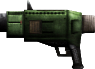

The pleasure of shrapnel spamming. Make hot steaming pain rain upon your enemies.

**Primary fire:** Deploy a curtain of hot lead, ricocheting all over and tearing everything to shreds.

**Secondary fire:** Launch the entire shell. Hot lead will be deployed wherever it hits.

**Tertiary fire (Zoom):** Toggle between wide spread (default) and tight spread for primary. Apart from that, also affects the effective range of the secondary fire, allowing you to lob these bombs farther away.

This weapon made the **Unreal Engine** cry, so **GZDoom** may suffer a lot too.

### Eviscerator shells ~ Replaces Ammo Box, Claw Orb
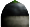

Little bundles of fun (in hot lead form) found either as single units (sometimes bunched up) or six-packs. There is no explanation for why they have an **owo** face scribbled on.

### Hellblazer (slot 6) ~ Replaces Rocket Launcher, Phoenix Rod, Hammer of Retribution
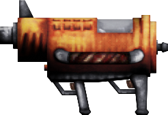

Another signature weapon of the **SWWM** series. This time in its third and far more improved revision.

**Primary fire:** Shoot a hot flaming rocket straight ahead.

**Secondary fire:** Lob the rocket as a grenade that will bounce around.

**Tertiary fire (Zoom):** Change the ammo type, there are four options (see ammo section below).

This thing is more explosive than it looks, so if you're reading this, Icarus, ***DO NOT*** use it at close range.

### Hellblazers ~ Replaces Rockets, Flame Orb
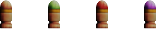

Ammo for the **Hellblazer**, found either as single units or packs. There are four types:

 - ***"Blazer"* missiles:** The standard ammunition, highly explosive.
 - ***"Crackshot"* cluster bombs:** All sorts of little bits that fly around after the initial blast.
 - ***"Ravager"* incendiary bombs:** Wide range, the flames will engulf pretty much everything around itself.
 - ***"Slayer"* warheads:** Frickin' nukes, you better keep your distance, because they are ***STRONG***.

### Biospark Carbine (slot 7) ~ Replaces Plasma Rifle, Hellstaff, Firestorm
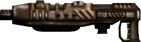

A relic from the olden days of **UnSX**. A potent energy weapon that uses what's best described as *"sentient lightning"*.

**Primary fire:** Small blobs of energy that explode violently on impact. Hold for rapid fire.

**Secondary fire:** Concentrated beam shot. A very old thing from the original **UnSX I** incarnation. Can penetrate multiple solid targets. Can also be held for rapid fire.

**Tertiary fire (Zoom):** Deploy a capsule that releases a massive sphere of pure energy, which will track down any hostile targets. It will rip through everything and even bounce off surfaces, but it has a rather limited lifespan.

If the beam hits either of the other energy blobs, they will detonate with highly amplified damage and range. Note that it is possible to alternate between primary and secondary modes while rapid firing, making this combo just a matter of precise timing.

### Biospark Unit ~ Replaces Cells, Runes
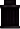

Ammunition for the Biospark Carbine. They contain a lot of energy, despite the small size.

### Silver Bullet JET (slot 8) ~ Replaces Plasma Rifle, Hellstaff, Arc of Death
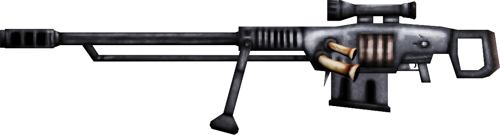

The definitive model of **Blackmann Arms**'s legendary **Silver Bullet** series. A lighter (43kg), lower caliber (1.150) variant of the former 1.350 **BEHEMOTH** model, discontinued due to being seen as too impractical.

**Primary fire:** Shoot the bullet. A second press chambers another round.

**Secondary fire:** On tap, picks the ammo for the next reload. On hold, also tap primary to manually cock (in case you want to eject unfired rounds).

**Reload:** Reload (what else is new) or switch ammo types.

**Zoom:** Press and hold to enter scoped mode. Release to pick the desired zoom level (can go up to 16x). Press again to exit scoped mode.

This weapon is generally not recommended for human use outside of power armor. Good thing you're not a human, then. Still, the recoil compensator jet engines can potentially deal damage to yourself if you don't have any armor, so be careful.

Note that going prone (crouching) will automatically disable the recoil compensators, increasing the potential damage of the bullets, but also reducing your mobility.

### 1.150 XSB Bullets ~ Replaces Cells, Runes
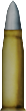

The 1.150 caliber **eXplosive Super Burst** bullets employ an **Explodium** shaped charge to be shot with enough energy to reach a relatively high velocity, allowing their massive bulk to penetrate several targets including walls. They are hard to come by, so spawns are scarce, and they won't even pop up in **Hammerspace Embiggeners**, only on higher tier **Fabricators**.

In the world, they may pop up as spare bullets or full mags. Each five bullets picked up will be automatically converted to a full mag in your inventory.

### 1.150 FCB Bullets ~ Replaces Cells, Runes
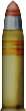

The more directly explosive counterpart of the **XSB**. Personally baptized by **Blackmann Arms** CEO **Hermann E. Ischer** himself as ***"Fat Chode Bombs"***, these **High-Explosive Squash Head** rounds will blast through walls on impact, hitting anything standing behind them, and in some cases, tearing down the wall itself too.

Same spawn conditions as the standard bullets.

### Candy Gun (slot 9) ~ Replaces BFG9000, Firemace, Bloodscourge (stub)
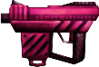

Coming from an old unreleased weapon mini-mod, the **Candy Gun** is like an **Explodium Gun** on steroids (or more specifically, on strawberry candy and pop rocks).

**Primary fire:** Explosive candy bullets. The blasts are a tasty treat of pain.

**Secondary fire:** Like its weaker counterpart, the mag is armed and yeeted with extreme prejudice.

**Reload:** Does what you'd expect.

Holding primary fire during the first few moments of alt fire will throw the weapon itself, armed and ready to explode if it hits anyone or anything. The blast area for this is pretty ridiculous. You can hold spare guns, by the way (up to four).

### Candy Gun Bullets ~ Replaces Cells, Runes

The ammo for this beast. Mags don't pop up on **Embiggeners**, only on the highest tier **Fabricators**.

In the world, you may find either spare bullets or full mags. Each seven bullets picked up will be automatically converted to a full mag in your inventory.

### Ynykron Artifact (slot 0) ~ Replaces BFG9000, Firemace, Wraithverge (arc)
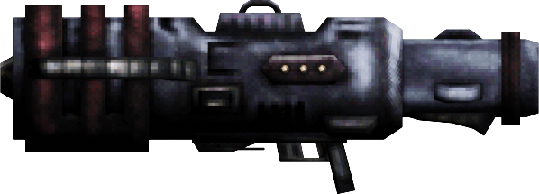

Popularly known as the ***"Death Cannon"***. One of the four ultimate weapons commissioned by the mad dictator god **Nedoshiaan**, before his defeat... or at least, a very detailed replica of it.

**Primary fire:** Initiate the charge process for one shot. Once it has completed charging, a second press will release the shot. Make sure to keep some distance from your targets, because the resulting blast might catch you in its violent chain reaction, and there is nothing that can prevent your death if that's the case.

**Secondary fire:** Swap the orientation of the ammo box, allowing for a *"reverse charge"*. The result of this is an implosion of massive strength located at a singular point, temporarily creating a vortex that will pull in anything that's not bolted down and tear it apart through potent tidal forces, including yourself if you don't keep your distance.

**Reload:** If charging, cancel the charge. Ammo will not be wasted, but it will have to vent for a while longer than after firing normally. If the ammo was spent, reloads as usual.

Unlike its previous incarnation in **SWWM Platinum**, this one doesn't have such an obscene pre-fire delay, so it's much easier to land a shot (not to mention also being far more lethal, thanks to the added chain reaction effect).

### Crystal Box
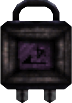

Additional ammo charge for the **Ynykron Artifact**. Contains a rod of polarized **Puronokorokinylum** crystal, highly volatile when heated and stimulated with concentrated light. These don't spawn in the world, so you'll have to get more ammo by finding additional weapon pickups or managing to afford one in the store, or trying your luck with a **Chancebox**.

## The Pickups
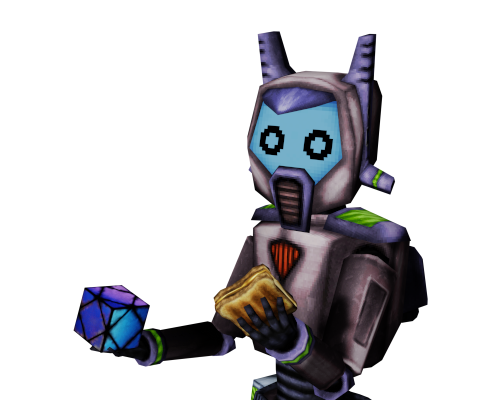

Of course, one cannot go without little helpers along their journey.

Healing items restore health (duh), armor items do exactly what you'd expect, and then there's all the various powerups that grant you useful abilities.

All of these can be carried in your inventory indefinitely before use, except in deathmatch, where they're activated immediately. Healing items are automatically used whenever possible (with the lowest tier healing items taking priority). Armor is immediately carried if you don't have any of that type on you, or if your existing armor drains and you have a spare. Most powerups can be toggled, unless specified otherwise.

### Health Nugget ~ Replaces Health Bonus, Crystal Vial

+1 health boost, up to a cap of 200 points.

### Health Tetrahedron ~ Replaces Stimpak, Quartz Flask

+10 health boost, up to a cap of 100 points.

### Health Cube ~ Replaces Medkit, Quartz Flask
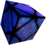

+20 health boost, up to a cap of 100 points.

### Refresher ~ Replaces Soulsphere, Mystic Urn

This artifact provides a +100 health boost plus a regeneration effect that heals +10 every 5 seconds, for up to 50 seconds, thus it doubles as a powerup. Its overhealing effects cap at 500 points (including the regen). Once its effects wear out, however, your excess health will gradually settle towards the typical 200 point cap. Unlike other health items, the **Refresher** auto-activates only if you're about to die. This usually prevents such a grim outcome... unless the damage is too high to counter.

### Armor Nugget ~ Replaces Armor Bonus, Timebomb of the Ancients, Disc of Repulsion, Flechette
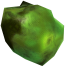

Cumulative armor items that can increase resistance to all damage by as much as you can find. Each nugget adds 1% to the total. Above 100%, damage gets turned into additional health (up to the standard 100% cap). The upper cap for these is 200%.

### Blast Suit ~ Replaces Green Armor, Silver Shield, Mesh Armor

The blast suit is a nice little light armor which provides a 30% reduction to damage and an additional 50% to splash damage.

Can handle a total of 150 damage points before breaking.

### War Armor ~ Replaces Blue Armor, Enchanted Shield, Falcon Shield
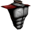

Decent armor, protects very well against all damage. Reduction factors are as follows:

 * 80% reduction for elemental (fire, ice, electric, etc.)
 * 50% reduction to everything else
 * 70% reduction for all splash damage (multiplicative on top of the other two)

Can eat up a total of 250 damage points before breaking.

### Grilled Cheese Sandwich ~ Replaces Megasphere, Morph Ovum, Platinum Helm
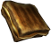

The ultimate meal. Grants a full 1000 health and magically gives you a full stack of **Armor Nuggets**, a **Blast Suit** and a **War Armor**. In addition it prevents you from dying at all when it activates automatically (this wondrous artifact can even save you from the destruction of the **Ynykron Artifact**). Keep in mind that this overhealing above 500 points fades away much quicker than the **Refresher**'s, and you can't use another sandwich again until the overheal fades.

### Ghost Artifact ~ Replaces Blur Sphere, Shadowsphere, Amulet of Warding
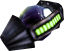

Actual 100% invisibility, a relic from the old **UnSX** days.

This powerup is capable of turning you absolutely invisible. However, it does not prevent you from making noise, so it's best to use it to sneak past certain encounters, or prepare surprise attacks.

Lasts 60 seconds once activated.

### Ragekit ~ Replaces Berserk, Tome of Power, Boots of Speed
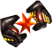

A special item with some... interesting effects.

Octuples melee damage, doubles movement speed, quarters damage taken... and has the side effect of turning you into a screaming beast.

*"Ragequit"* happens after 30 seconds.

### Elemental coating ~ Replaces Radsuit
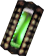

A proper radsuit replacement, and sort of a rehash of the old ***"Barrier"*** powerup from previous **SWWM** versions.

For 60 seconds, you can walk on hazardous floors or even take a nice swim in corrosive slime, scorching magma, freezing waters, or other extremes, while also having 100% resistance to elemental attacks.

### Gravity suppressor ~ Replaces Wings of Wrath
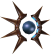

Continuing with the *"replace jump boots with flight"* tradition in previous **SWWM** entries, this time you'll be getting a proper easy to control antigravity powerup.

For 60 seconds, you can fly around in the air at 2x your normal walking speed, but do note that your movements aren't very precise while in this state.

### Fucking Invinciball ~ Replaces Invulnerability, Ring of Invincibility, Icon of the Defender
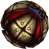

This thing makes you impervious to pretty much everything excluding the **Ynykron Artifact**.

You're fucking invincible for a total of 20 seconds.

### Hammerspace Embiggener ~ Replaces Backpack, Bag of Holding, Dragonskin Bracers
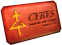

Each of these you pick up increases your ammo capacity (not necessarily doubling it), stacking up to 8 times. They also give you some extra ammo, like a vanilla backpack would (though not for all weapons).

### Universal Ammo Fabricator ~ Replaces Mana / Krater of Might in Hexen

Separated into four tiers, they work pretty much like the ammo cubes in **Doom Tournament**, except they try to *"balance"* the total ammo given. The max tier fabricator is the only one capable of producing ammo for superweapons (excluding the **Ynykron Artifact**).

### Lamp ~ Replaces Lite-Amp, Torch

A floating lamp companion, may attract moths. The moths will disperse and attack nearby enemies when toggling it off.

### Omnisight ~ Replaces Computer Map, Map Scroll
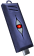

Reveals the entire layout of the map and shows key locations in the HUD. Also allows you to highlight pickups through walls when holding the **Item Sense** button.

## The Collectibles
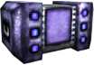

Every now and then you will find these strange ***"Lucky Chance Boxes"*** in secret areas, which you can open by pressing Use. While some will drop very useful goodies, one among them will provide you instead with a randomly selected item from a pool of various *"collectibles"*. On pickup, these will give you a nice extra score based on their estimated market price. Some of these collectibles will only appear when you play specific IWADs (or those that go chronologically after them, e.g.: Heretic collectibles appearing in Hexen).

***(Do note that this feature is currently not fully implemented, there may be missing models)***

### NUTATCO™ Chocolate Bar

A light snack, said to have a "savage taste". The branding was entirely Saya's doing thanks to her position as #1 sponsor of Vestal Foods.

### Frispy™ Tasty Corn Snack
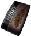

Saya's favorite barbecue-flavored corn nuts. She snacks on so many bags of these that their tasty scent has stuck to her permanently, becoming a walking advertisement for them. Kirin likes it, at least.

### The Akari Project
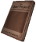

A copy of Saya's famous sci-fi novel about interdimensional travel. Saya has frequently cited it to dab hard on the UAC and their failures. The interportal system devised by Saya in 2171 was named after this.

### Meidobot - Love Signals
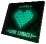

Debut album of Maidbot Miyamoto. Very cute and romantic J-Pop. Yes, it's a CD, and yes, some people still have CD drives out there. The album is considered a declaration of love to Saya, although it should be noted that this predates Maidbot gaining sentience (not that it makes much of a difference, as her feelings for Saya turned out to be very real).

### Perfectly Generic Cube

A perfectly generic cube. It is exactly 128mm across each side, sports a pure green color and is quite smoothly polished. Its purpose is unknown, but it's a popular collector's item.

### Haunted Saya Bean Plush
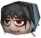

Eats your snacks and calls you a horny. Emits a giggle when you squeeze it. Yet another of Nukritas 2xx's little handcrafted dolls. May or may not be really haunted.

### Demolitionist Plush (Heretic)
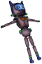

A soft and squishy plush doll of you! This became very popular after the events of Doom, with the Demolitionist having defeated the demons and saved Earth. Fully articulated, face and tags glow in the dark.

### Toot Froot™ Peach Juice (Hexen)
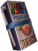

Saya began to stock up on these after her marriage with Kirin, for some unexplained reason. She says the taste reminds her of him. Kirin also seems to enjoy drinking them, perhaps a bit too much, in fact.

### Akkouxhei Milk Breads (Hexen)
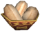

A tasty treat from Kirin's homeland. These soft and fluffy pastries are so sweet they may be even lethal if consumed in excess. Saya gave herself a heart attack once after stuffing her face full of them.

### I Married A Cherry Boy Emperor But It Turns Out He's Really Cute In Lingerie!? (Hexen)
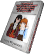

A single-volume manga by Saya Miyamoto "based on true events" about a young girl who marries a seemingly pure and innocent emperor with a secret crossdressing hobby.

### Kirin Plush (Hexen)
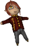

The most adorable and huggable plush doll of the cutest and sweetest emperor. This was not only also handcrafted by Nukritas 2xx, but also imbued with Kirin's magic, his blessing making anyone feel warm and fuzzy when holding it close to their heart. Like the Saya plush, also emits a cute giggle when squeezed.

## The HUD
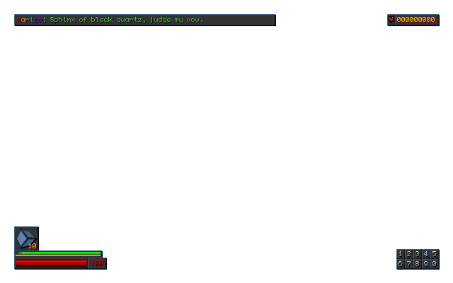

Pretty simplistic so it doesn't get in the way of the action. Some things may be configurable.

### Top left corner

Message display. Can be configured to show different numbers of messages depending on whether the chat prompt is open. Chat messages take much longer to expire than others, so there's less of a chance to miss them, as they might pop back up when the less important ones expire. In multiplayer games, a full chat history can be read at any time in the **Demolitionist Menu**. Repeated messages are compressed with a multiplier suffix.

### Top right corner

Current score.

The scoring system is pretty straightforward. Each enemy you kill will give you points according to 5% of its base health, rounded up to the nearest multiple of 10 and capped to 1000, plus some bonuses (in order of application):

 * +500 if the enemy was killed with the **Deep Impact** primary (humiliation).
 * +300 if the enemy was killed with your butt while dashing (no, seriously).
 * +600 if the enemy was killed with a blown kiss (oh my~).
 * x2 for an overkill (enemy was gibbed or received twice its base health in damage).
 * x1.5 for each combo level, up to x8 in steps of x0.5. Kills are considered combos if multiple enemies are killed within 5 seconds of each other.
 * +100 for killing an enemy without having taken damage since last spawn, with extra +10 boosts for consecutive kills (extra boosts taper off after 10x).
 * +2000 if the enemy killed is a boss.
 * +1000 if you've killed the last enemy in the map.

You are also given +100 points for each secret found, +1000 if it's the final secret. Countable items give +10 points each or +500 if it's the final item. In addition, +5000 will be given to all players if the level is fully cleared (100% kills/items/secrets).

Score can be used to buy items on the in-game store, and it is preserved between hubs, but pistol starts will reset it.

In **Doom** and **Heretic**, collected keys will be displayed below the score box.

When the **Automap** is open, the map name and stats will also be shown here.

### Bottom left corner

Your health and fuel, along with an inventory box, and all active armors and powerups (with their respective durability/duration).

### Bottom border

Voice acting subtitles and pickup messages. Repeated pickups will have a multiplier suffix added. Total messages shown are also configurable.

### Bottom right corner

The weapon slots. Above them, the currently equipped weapon's stats (i.e.: ammo(s) and such).

### Targeter

Because in the middle of the chaos that is this mod you might have a hard time trying to figure out where everything is in between explosions and massive smoke clouds, a targetter has been implemented, which will show the following:

- **Players and monsters:** Draws an identification label and a health bar. The bar can display overhealing, and also indicate when someone is invulnerable. When they take damage or get healed, numbers (either red or green) will pop up around them. The targetter only picks up enemies in your direct line of sight, gradually fading once you lose sight of them, and can only display up to 40 individual bars (configurable), giving priority first to players, then the nearest enemies. The **Omnisight** increases the time out-of-sight targets remain marked.
- **Keys and map exits:** If you've picked up an **Omnisight**, key items and any exit lines will be marked and labeled, along with a little distance indicator in map units. Note that this doesn't work for script-triggered exits.
- **Highlighted items:** Holding the ***"Item Sense"*** button will mark and label nearby items, in case they're hard to see among countless piles of corpses or dim lighting. If you have an **Omnisight**, items that are out of view (e.g.: behind walls) will be marked too.

These components are toggleable.

## The End
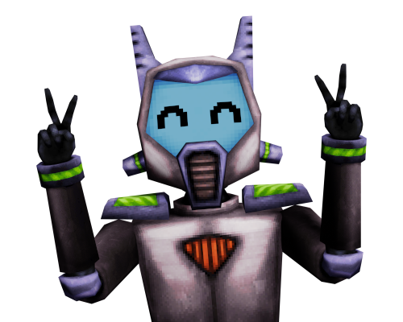

That's all the info I can provide on this here Readme file, at least for now. Stay tuned for much more that will come in the future, as this mod is in constant development.

Anyway, hope you have lots of fun playing **SWWM GZ**. Godspeed, and happy fragging!

— *Marisa*
